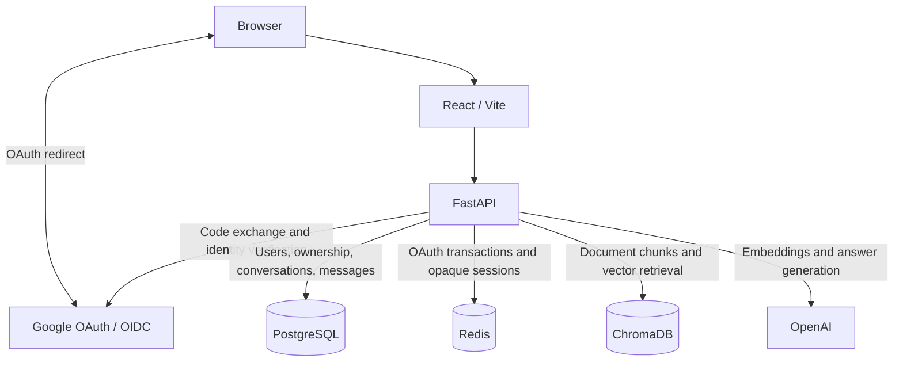

# AI Knowledge Assistant

AI Knowledge Assistant is a full-stack PDF question-answering application built with React and FastAPI. Users sign in with Google, upload documents, ask questions with filename/page citations, and revisit conversations stored in PostgreSQL. The backend enforces document ownership before retrieving document-scoped evidence from ChromaDB and generating answers through OpenAI. Deterministic conversational routing, bounded LLM history, and isolated offline evaluation provide safeguards around the RAG workflow.

**Status: v0.1.0 — application implementation frozen for portfolio presentation.** This project demonstrates authenticated RAG application engineering, persistence, access control, and evaluation infrastructure. It is not presented as a production-ready deployment.

## Demo

Demo assets are not included yet. A future screenshot sequence or short recording should show Google login, PDF upload and the document list, a document question with filename/page citations, an unknown question, and reopening a saved conversation. Use synthetic documents and show the actual application responses.

## Features

### User-facing capabilities

- Google sign-in and logout.
- PDF upload, user-specific document listing, selection, and deletion.
- Multiple conversations per document with persistent message history.
- Document-grounded answers with inline filename/page citation labels and source displays.
- Loading, error, and empty states in a custom React interface.

Reopening a conversation reads stored messages without an LLM call. Inline citations remain in saved answer text; the separate structured source list is not persisted.

### Engineering capabilities

- FastAPI API with PostgreSQL persistence through SQLAlchemy.
- Redis-backed opaque sessions and browser-bound OAuth transactions.
- ChromaDB vector storage and OpenAI embeddings and generation.
- Ownership authorization before retrieval, with canonical PostgreSQL document UUID filtering.
- Complete persisted history with a bounded recent history supplied to the LLM.
- Deterministic routing for recognized greetings, thanks, acknowledgments, and sign-off phrases.
- Deterministic fallback when retrieval returns no chunks.
- Isolated evaluation harness and a narrowly scoped offline GitHub Actions workflow.

## Architecture



FastAPI resolves the session cookie through Redis to a PostgreSQL user. Route-level authorization checks document ownership and conversation association before accessing evidence. PostgreSQL is the source of truth for application records; Chroma stores document text, vectors, and provenance metadata. Redis stores transient authentication state.

### Data model

```text
User → Documents → Conversations → Messages
       one-to-many at each relationship
```

Records use UUID identifiers. Conversation ownership is derived through its document. Messages store role, content, and timestamps; the conversation timestamp supports recent-activity ordering.

## RAG pipeline

1. Extract PDF text with `pypdf` and chunk each page independently.
2. Split near word boundaries, targeting 1,000 characters with approximately 200 characters of overlap.
3. Embed chunks with `text-embedding-3-small`; store text and document UUID, filename, and page metadata in Chroma.
4. Authorize the question against PostgreSQL ownership, then embed the question and retrieve up to five chunks filtered by the canonical document UUID.
5. Apply the optional `RAG_MAX_DISTANCE` filter. It is disabled by default; no calibrated production threshold has been selected.
6. Supply retained chunks and the latest configured prior messages to `gpt-5.6-luna` through the OpenAI Responses API.
7. Return the answer and source/page metadata. The prompt requests citations in `[Source: <source>, Page <page>]` format.

`RAG_MAX_HISTORY_MESSAGES` defaults to 10 messages, not 10 conversation turns. All historical messages remain in PostgreSQL. History helps resolve references; the prompt instructs the model to use retrieved context as factual evidence.

Recognized conversational phrases bypass embeddings and generation. For RAG questions, zero retained chunks produce this response without an LLM call:

> The information is not available in the provided document.

With nonempty retrieval, unknown-answer handling depends on the LLM following its instructions. Returned sources are deduplicated by `(source, page)`; all retained chunks remain in the LLM context. Runtime citation support is not independently validated.

## Authentication and authorization

- Google authorization-code flow with server-side token exchange and ID-token verification.
- Random state and nonce stored in a ten-minute Redis transaction, bound to an opaque HttpOnly browser cookie and consumed atomically with `GETDEL`.
- Google user lookup by provider and subject, backed by a database uniqueness constraint.
- Opaque seven-day Redis sessions and host-only, HttpOnly, SameSite=Lax session cookies.
- Exact configured Origin validation and Fetch Metadata checks on protected state-changing routes.
- Credentialed CORS limited to the configured frontend origin.
- Document ownership and document/conversation association checks; missing and unauthorized documents receive generic responses.

Production configuration requires secure cookies, but HTTPS termination belongs to deployment infrastructure. Requests without Origin or Fetch Metadata headers are currently allowed. General CSRF tokens, PKCE, additional Google claim checks, and production Redis hardening remain open work. See [authentication documentation](docs/authentication.md) for the precise security boundary.

## Technology stack

| Layer | Technology |
|---|---|
| Interface | React, TypeScript, Vite, custom CSS |
| API | FastAPI, Pydantic |
| Application data | PostgreSQL, SQLAlchemy, psycopg |
| Authentication state | Redis, Google Auth |
| PDF processing | pypdf |
| Retrieval | ChromaDB, OpenAI `text-embedding-3-small` |
| Generation | OpenAI Responses API, `gpt-5.6-luna` |
| Verification | pytest, GitHub Actions, TypeScript/Vite build |

## Repository layout

```text
backend/app/             API, authentication, persistence, and RAG implementation
backend/tests/           Automated tests, protected evaluations, synthetic fixtures
frontend/src/            React interface and styling
docs/authentication.md  Authentication design and security limitations
docs/evaluation.md      Offline/live evaluation workflow and discovery safety
.github/workflows/      Narrow offline CI workflow
pytest.ini              Recursive discovery exclusion for backend/app
```

Legacy `backend/app/test_*.py` files are manual diagnostic scripts with possible import-time side effects. They are not part of the ordinary automated workflow.

## Local development

CI uses Python 3.12 and Node 24. Running the application also requires PostgreSQL, Redis, a configured Google OAuth client, and OpenAI access.

**Fresh-clone setup limitations:** there is no root `.env.example` or schema migration/bootstrap mechanism in the repository. The application imports `redis`, but `backend/requirements.txt` does not declare that package. The following commands cover the declared dependency installation and launch paths; they are not a complete reproducible bootstrap until those prerequisites are supplied.

From the repository root:

```sh
python3.12 -m venv backend/.venv
./backend/.venv/bin/python -m pip install -r backend/requirements.txt
```

Provision the PostgreSQL schema corresponding to `backend/app/models.py`. Redis is currently fixed to `redis://localhost:6379` and must support `GETDEL`. Configure the Google OAuth callback to match `GOOGLE_REDIRECT_URI` and the backend `/auth/google/callback` route.

Supply these backend environment values; configuration can load a root `.env` file:

| Variable | Purpose / default |
|---|---|
| `OPENAI_API_KEY` | Required at backend import; keep server-side |
| `DATABASE_URL` | Required PostgreSQL connection URL |
| `GOOGLE_CLIENT_ID` | Google OAuth client ID |
| `GOOGLE_CLIENT_SECRET` | Server-side Google OAuth client secret |
| `GOOGLE_REDIRECT_URI` | Registered backend OAuth callback URL |
| `FRONTEND_URL` | Defaults to `http://localhost:5173` |
| `API_URL` | Defaults to `http://localhost:8000`; currently informational |
| `ENVIRONMENT` | Defaults to `development` |
| `SESSION_COOKIE_SECURE` | Defaults false in development; must be true in production |
| `RAG_MAX_DISTANCE` | Optional finite numeric value; unset/blank disables filtering |
| `RAG_MAX_HISTORY_MESSAGES` | Positive integer; defaults to 10 |

Once runtime dependencies, services, schema, and configuration are available:

```sh
./backend/.venv/bin/python -m uvicorn backend.app.main:app --reload
```

In a separate terminal:

```sh
cd frontend
npm ci
npm run dev
```

`frontend/.env.example` documents `VITE_API_URL=http://localhost:8000`. Development requests use the Vite proxy; builds use the configured API URL directly. Never place backend secrets in `VITE_*` variables.

## Evaluation and safe testing

The Acme benchmark includes text/PDF fixtures, six answerable categories—customer ID, plan, monthly price, renewal date, SLA, and retention—and five unanswerable categories—revenue, CEO, headquarters, programming language, and founding date.

- Real retrieval reports answer-bearing **Hit@1, Hit@3, and Hit@5**: a hit occurs when a retrieved chunk within K contains the expected answer phrase. This is not conventional chunk-level Recall@K.
- Mocked retrieval is a page-presence/retrieval-helper regression check.
- PDF citation scoring requires every parsed citation to match retrieved source/page evidence containing the expected answer phrase. Offline cases cover supported citations, unsupported extras, and missing or incorrect evidence.
- Live answer correctness uses expected phrases; unknown-answer evaluation uses refusal and fabrication heuristics.

These are component evaluations that bypass `/ask`. The small synthetic benchmark does not establish universal production accuracy. Text-fixture retrieval uses character chunking, while production PDF ingestion chunks pages near word boundaries. Offline success is not a live benchmark score.

Run only the protected offline set from the repository root:

```sh
env -u RUN_LIVE_RAG_EVALUATIONS -u PYTEST_ADDOPTS \
  PYTHONDONTWRITEBYTECODE=1 PYTEST_DISABLE_PLUGIN_AUTOLOAD=1 \
  ./backend/.venv/bin/pytest \
  backend/tests/test_evaluation_harness.py \
  backend/tests/test_retrieval_evaluation.py \
  backend/tests/test_pdf_citation_evaluation.py \
  -k 'not test_real' -p no:cacheprovider -v
```

The harness prevents persistent application Chroma initialization during protected evaluation collection and tests safety in guarded fresh processes. Live evaluations skip unless explicitly opted into with `RUN_LIVE_RAG_EVALUATIONS=1`; enabling it permits real embedding/LLM calls. Live collections use ephemeral Chroma.

`pytest.ini` excludes `backend/app` from normal recursive discovery. Explicitly targeting legacy scripts can bypass that exclusion. Broad `pytest backend/tests/` is also unsuitable for service-free execution: other legitimate tests import application clients or require PostgreSQL. See [evaluation documentation](docs/evaluation.md) for details.

## Continuous integration

[The offline workflow](.github/workflows/offline-tests.yml) runs on pushes and pull requests using Ubuntu 24.04, Python 3.12, and Node 24. It installs existing dependencies, runs the three-file offline command above, and separately runs `npm ci` and `npm run build` in `frontend/` (`tsc -b && vite build`).

It clears live opt-in and inherited pytest options, disables plugin autoloading, and avoids broad test discovery. It provisions no PostgreSQL, Redis, or Chroma services and supplies no application secrets. Live evaluations, database integration tests, and legacy smoke scripts are excluded. Dependency installation requires network access; frontend build needs no backend services. Workflow presence alone is not evidence of a successful CI run.

## Limitations

- Text-extractable PDFs only; no OCR, image ingestion, streaming, or PDF citation viewer.
- Synchronous ingestion with no background job queue; upload validation checks the filename extension and has no explicit size limit.
- No calibrated retrieval-distance threshold or context deduplication; generated citations are requested by prompt rather than enforced at runtime.
- PostgreSQL and Chroma operations are not a single atomic transaction. Failed ingestion and deletion can require cleanup across the two systems.
- Full history is retained and loaded even though only recent messages reach the LLM. Separate source lists are not restored with old messages.
- Small heuristic component benchmarks; no representative end-to-end `/ask` accuracy measurement.
- Incomplete fresh-clone setup, unpinned backend dependencies, and unfinished production security/deployment hardening.

The v0.1.0 implementation is frozen. Demo assets and presentation documentation can describe the existing behavior without implying additional application capabilities.
